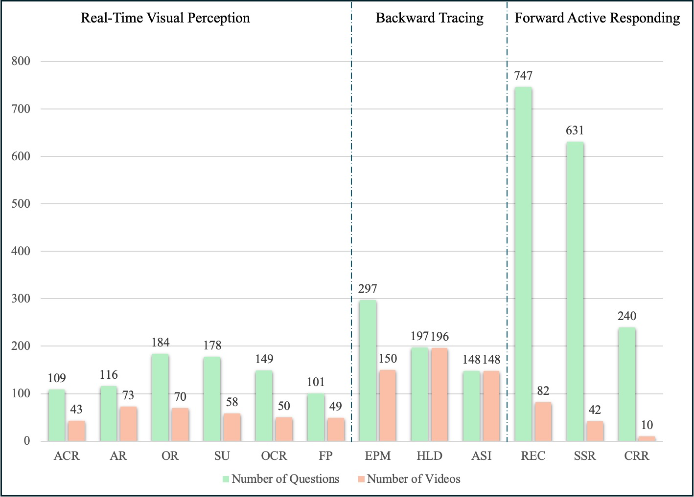
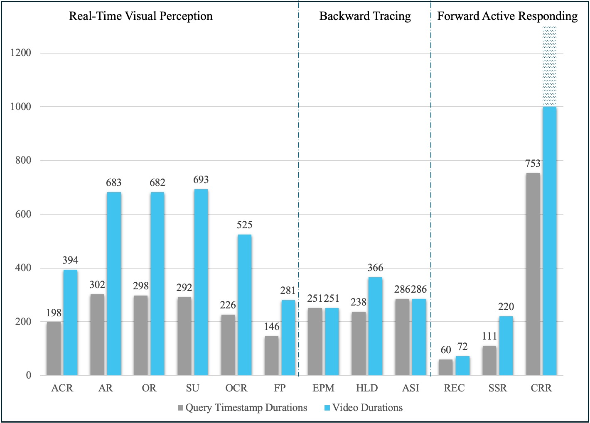

<h1 align="center">
  <font color=#0088cc>O</font><font color=#060270>V</font><font color=#0088cc>O</font>-Bench: How Far is Your Video-LLMs from Real-World <font color=#0088cc>O</font>nline <font color=#060270>V</font>ide<b style="color: #0088cc;">O</b> Understanding?
</h1>

<p align="center">
  🔥🔥OVO-Bench is accepted by CVPR 2025!🔥🔥
</p>

<p align="center">
  <a href="https://arxiv.org/abs/2501.05510" style="margin-right: 10px;"> 
    
  </a>
  <a href="https://huggingface.co/datasets/JoeLeelyf/OVO-Bench" style="margin-right: 10px;"> 
    
  </a>
</p>

> **Important Note:** Current codebase is modified compared to our initial arXiv paper. We strongly recommend that any use of OVO-Bench should be based on current edition.

## Introduction
### 🌟 Three distinct problem-solving modes
-  **Backward Tracing**: trace back to past events to answer the question.
-  **Real-Time Visual Perception**: understand and respond to events as they unfold at the current timestamp.
-  **Forward Active Responding**: delay the response until sufficient future information becomes available to answer the question accurately.

### 💫Chain-of-Time Thinking Process
OVO-Bench evaluates Video-LLMs' ability to find temporal visual clues from ongoing input, allowing models to wait for sufficient evidence before responding. We term this approach the Video Chain-of-Time thinking process, analogous to Chain-of-Thought reasoning in LLMs.
<p align="center">
  
</p>


### Dataset Statistics
-  **644** videos
-  **3,100** Queries
<p align="center">
  
</p>

-  **263.42s** Average query timestamp.

<p align="center">
  
</p>


##  Dataset Examples
<p align="center">
  
</p>

## Evaluation Pipeline

### Requirements
Following modules are required for inference and scoring pipeline.
```txt
moviepy==1.0.3
numpy
pillow
tqdm
```
Or run `pip insall -r requirements` to install all required modules.

### Data Preparation
- Download src videos and chunk videos locally: 
  1. Download `src_videos.tar.parta[a~e]`(~44GB) from [huggingface-repo](https://huggingface.co/datasets/JoeLeelyf/OVO-Bench)
  2. Place it under `./data`  and then concat and untar all files
  3. Run `bash scripts/chunk_video.sh` to get all chunked video clips.
- (Recommend) Downloaded our pre-chunked video clips:
  1. Download `chunked_videos.tar.parta[a~o]`(~144GB) from [huggingface-repo](https://huggingface.co/datasets/JoeLeelyf/OVO-Bench)
  2. Place it under `./data` and then concat and untar all files.

### Inference and Score
We divide our evaluation pipeline into two parts: `inference` and `score`. For our released models, run our provided scripts under `./scripts` directory. For example, for InternVL2, run:
```bash
bash scripts/inference/Gemini.sh
```
All inference results will be saved under `./results/[MODEL_NAME]`. Then run our scoring scripts:
```bash
bash scripts/score/Gemini.sh
```
Scores will show in cli:
```txt
Offline Model: Gemini
Evaluate Backward Tracing...
Task: ASI, Acc: 76.35
Task: HLD, Acc: 52.69
Task: EPM, Acc: 58.59
Backward Avg.: 62.54

Evaluate Real-time Visual Perception...
Task: ATR, Acc: 79.31
Task: ACR, Acc: 66.97
Task: OCR, Acc: 85.91
Task: STU, Acc: 58.43
Task: OJR, Acc: 61.96
Task: FPD, Acc: 63.37
Realtime Avg.: 69.32

Evaluate Forward Active Responding...
Task: REC, Acc: 35.53
Task: SSR, Acc: 74.24
Task: CRR, Acc: 61.67
Forward Avg.: 57.15

Total Avg.: 63.00
```
To evaluate your own models, inherit `OVOBenchOffline/Online` class in `./utils/OVOBench.py` and implement your own inference pipeline. Refer to our provided models under `./models` for further details.

## License
OVO-Bench is released under `CC BY-NC-SA 4.0` license. By downloading our dataset from our website or other sources, the user agrees to adhere to the terms of `CC BY-NC-SA 4.0` and licenses of the source datasets

## 🫥 Experimental Results
<p align="center">
  
</p>

<p align="center">
  
</p>

## 📍 Citing OVO-Bench
```bibtex
@misc{li2025ovobenchfarvideollmsrealworld,
      title={OVO-Bench: How Far is Your Video-LLMs from Real-World Online Video Understanding?}, 
      author={Yifei Li and Junbo Niu and Ziyang Miao and Chunjiang Ge and Yuanhang Zhou and Qihao He and Xiaoyi Dong and Haodong Duan and Shuangrui Ding and Rui Qian and Pan Zhang and Yuhang Zang and Yuhang Cao and Conghui He and Jiaqi Wang},
      year={2025},
      eprint={2501.05510},
      archivePrefix={arXiv},
      primaryClass={cs.CV},
      url={https://arxiv.org/abs/2501.05510}, 
}
```